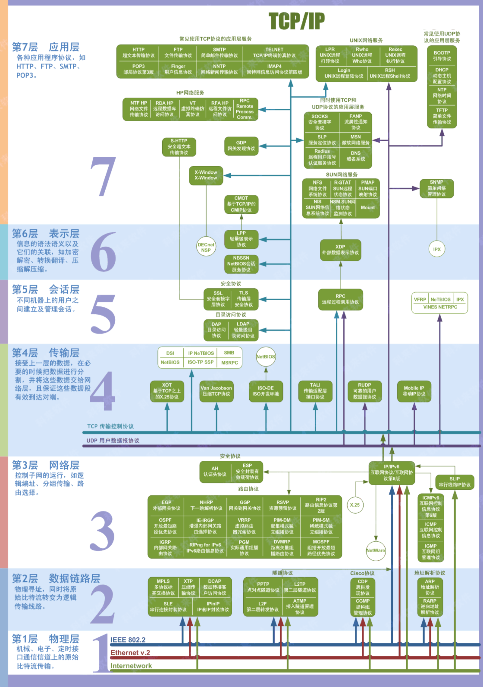
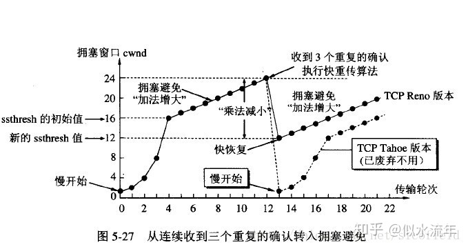

# 面試問題整理

## 作業系統

### 進程和執行緒

1. 進程是作業系統資源配置的最小單位，執行緒是 CPU 任務調度的最小單位。一個進程可以包含多個執行緒，所以進程和執行緒都是一個時間段的描述，是 CPU 工作時間段的描述，不過是顆粒大小不同。
2. 不同進程間資料很難共用，同一進程下不同執行緒間資料很易共用。
3. 每個進程都有獨立的代碼和資料空間，進程要比執行緒消耗更多的電腦資源。執行緒可以看做羽量級的進程，同一類執行緒共用代碼和資料空間，每個執行緒都有自己獨立的運行棧和程式計數器，執行緒之間切換的開銷小。
4. 進程間不會相互影響，一個執行緒掛掉將導致整個進程掛掉。
5. 系統在運行的時候會為每個進程分配不同的記憶體空間；而對執行緒而言，除了 CPU 外，系統不會為執行緒分配記憶體（執行緒所使用的資源來自其所屬進程的資源），執行緒組之間只能共用資源。

### 進程的組成部分

進程由進程控制塊（PCB）、程式段、資料段三部分組成。

### 進程的通信方式

1. 無名管道：半雙工的，即資料只能在一個方向上流動，只能用於具有親緣關係的進程之間的通信，可以看成是一種特殊的檔，對於它的讀寫也可以使用普通的 read、write 等函數。但是它不是普通的檔，並不屬於其他任何檔案系統，並且只存在於記憶體中。
2. FIFO 具名管道：FIFO 是一種檔案類型，可以在無關的進程之間交換資料，與無名管道不同，FIFO 有路徑名與之相關聯，它以一種特殊設備檔形式存在於檔案系統中。
3. 訊息佇列：訊息佇列，是消息的連結表，存放在內核中。一個訊息佇列由一個識別字（即佇列 ID）來標識。
4. 信號量：信號量是一個計數器，信號量用於實現進程間的互斥與同步，而不是用於存儲進程間通信資料。
5. 共用記憶體：共用記憶體指兩個或多個進程共用一個給定的存儲區，一般配合信號量使用。


### 作業系統中進程調度策略有哪幾種？

- FCFS(先來先服務)，優先順序，時間片輪轉(swap to other by time change)，shortest first

### 執行緒同步的方式有哪些？

1. 互斥量：採用互斥物件機制，只有擁有互斥物件的執行緒才有訪問公共資源的許可權。因為互斥物件只有一個，所以可以保證公共資源不會被多個執行緒同時訪問。
2. 信號量：它允許同一時刻多個執行緒訪問同一資源，但是需要控制同一時刻訪問此資源的最大執行緒數量。
3. 事件（信號）：通過通知操作的方式來保持多執行緒同步，還可以方便的實現多執行緒優先順序的比較操作

### 進程有哪幾種狀態？

1. 就緒狀態：進程已獲得除處理機以外的所需資源，等待分配處理機資源
2. 運行狀態：佔用處理機資源運行，處於此狀態的進程數小於等於 CPU 數
3. 阻塞狀態： 進程等待某種條件，在條件滿足之前無法執行

### 鎖死的 4 個必要條件

1. 互斥條件：一個資源每次只能被一個執行緒使用；
2. 請求與保持條件：一個執行緒因請求資源而阻塞時，對已獲得的資源保持不放；
3. 不剝奪條件：進程已經獲得的資源，在未使用完之前，不能強行剝奪；
4. 迴圈等待條件：若干執行緒之間形成一種頭尾相接的迴圈等待資源關係。

### 如何避免（預防）鎖死

1. 破壞“請求和保持”條件：讓進程在申請資源時，一次性申請所有需要用到的資源，不要一次一次來申請，當申請的資源有一些沒空，那就讓執行緒等待。不過這個方法比較浪費資源，進程可能經常處於饑餓狀態。還有一種方法是，要求進程在申請資源前，要釋放自己擁有的資源。
2. 破壞“不可搶佔”條件：允許進程進行搶佔，方法一：如果去搶資源，被拒絕，就釋放自己的資源。方法二：作業系統允許搶，只要你優先順序大，可以搶到。
3. 破壞“迴圈等待”條件：將系統中的所有資源統一編號，進程可在任何時刻提出資源申請，但所有申請必須按照資源的編號順序提出（指定獲取鎖的順序，順序加鎖）。

## 電腦網路　https://www.cnblogs.com/0201zcr/p/4694945.html

### OSI

### tcp 和 udp 區別

1. TCP 連線導向，UDP 是不需連線的，即發送資料之前不需要建立連接。
2. TCP 提供可靠的服務通過 TCP 連接傳送的資料，無差錯，不丟失，不重複，且按序到達;UDP 不保證可靠交付。
3. TCP 面向位元組流，實際上是 TCP 把資料看成一連串無結構的位元組流，UDP 是面向報文的，UDP 沒有擁塞控制，因此網路出現擁塞不會使源主機的發送速率降低（對即時應用很有用，即時視訊會議）
4. 每一條 TCP 連接只能是一對一，UDP 支援一對一，一對多，多對一和多對多的交互通信。
5. TCP 首部開銷 20 位元組，UDP 的首部開銷只有 8 個位元組。
6. TCP 的邏輯通信通道是全雙工的可靠通道，UDP 則是不可靠通道。

### Http 請求的完全過程

1. 流覽器根據功能變數名稱解析 IP 位址（DNS）,並查 DNS 緩存
2. 流覽器與 WEB 伺服器建立一個 TCP 連接
3. 流覽器給 WEB 伺服器發送一個 HTTP 請求（GET/POST）：一個 HTTP 請求報文由請求行（request line）、請求頭部（headers）、空行（blank line）和請求資料（request body）4 個部分組成。
4. 服務端回應 HTTP 回應報文，報文由狀態行（status line）、相應頭部（headers）、空行（blank line）和回應資料（response body）4 個部分組成。
5. 流覽器解析渲染

### HTTP 1.0/1.1/2.0

#### 1.0

- 流覽器與伺服器只保持短暫的連接，流覽器的每次請求都需要與伺服器建立一個 TCP 連接，伺服器完成請求處理後立即斷開 TCP 連接,上一次和下一次請求完全分離

### 1.1

- 持久連接（HTTP/1.1 的預設模式使用帶流水線的持久連接），在一個 TCP 連接上可以傳送多個 HTTP 請求和回應
- 1xx：指示資訊--表示請求已接收，繼續處理
- 2xx：成功--表示請求已被成功接收、理解、接受
- 3xx：重定向--要完成請求必須進行更進一步的操作
- 4xx：用戶端錯誤--請求有語法錯誤或請求無法實現
- 5xx：伺服器端錯誤--伺服器未能實現合法的請求

### 2.0

- 多工允許同時通過單一的 HTTP/2 連接發起多重的請求-回應訊息
- 多工允許同時通過單一的 HTTP/2 連接發起多重的請求-回應訊息

### tcp 和 udp 的優點

- TCP 的優點： 可靠，穩定 TCP 的可靠體現在 TCP 在傳遞資料之前，會有三次握手來建立連接，而且在資料傳遞時，有確認、視窗、重傳、擁塞控制機制，在數據傳完後，還會斷開連接用來節約系統資源。 TCP 的缺點： 慢，效率低，佔用系統資源高，易被攻擊 TCP 在傳遞資料之前，要先建連接，這會消耗時間，而且在資料傳遞時，確認機制、重傳機制、擁塞控制機制等都會消耗大量的時間，而且要在每台設備上維護所有的傳輸連接，事實上，每個連接都會佔用系統的 CPU、記憶體等硬體資源。 而且，因為 TCP 有確認機制、三次握手機制，這些也導致 TCP 容易被人利用，實現 DOS、DDOS、CC 等攻擊。
- UDP 的優點： 快，比 TCP 稍安全 UDP 沒有 TCP 的握手、確認、視窗、重傳、擁塞控制等機制，UDP 是一個無狀態的傳輸協定，所以它在傳遞資料時非常快。沒有 TCP 的這些機制，UDP 較 TCP 被攻擊者利用的漏洞就要少一些。但 UDP 也是無法避免攻擊的，比如：UDP Flood 攻擊…… UDP 的缺點： 不可靠，不穩定 因為 UDP 沒有 TCP 那些可靠的機制，在資料傳遞時，如果網路品質不好，就會很容易丟包。 基於上面的優缺點，那麼： 什麼時候應該使用 TCP： 當對網路通訊品質有要求的時候，比如：整個資料要準確無誤的傳遞給對方，這往往用於一些要求可靠的應用，比如 HTTP、HTTPS、FTP 等傳輸檔的協議，POP、SMTP 等郵件傳輸的協定。 在日常生活中，常見使用 TCP 協定的應用如下： 流覽器，用的 HTTP FlashFXP，用的 FTP Outlook，用的 POP、SMTP Putty，用的 Telnet、SSH QQ 檔案傳輸。什麼時候應該使用 UDP： 當對網路通訊品質要求不高的時候，要求網路通訊速度能儘量的快，這時就可以使用 UDP。 比如，日常生活中，常見使用 UDP 協定的應用如下： QQ 語音 QQ 視頻 TFTP。

### 三次握手

- 第一次握手：建立連接時，用戶端發送 syn 包（syn=x,1000）到伺服器，並進入 SYN_SENT 狀態，等待伺服器確認；SYN：同步序列編號（Synchronize Sequence Numbers）。
- 第二次握手：伺服器收到 syn 包，必須確認客戶的 SYN（ack=x+1,1001），同時自己也發送一個 SYN 包（syn=y,2000），即 SYN+ACK 包，此時伺服器進入 SYN_RECV 狀態；
- 第三次握手：用戶端收到伺服器的 SYN+ACK 包，向伺服器發送確認包 ACK(ack=y+1,2001），此包發送完畢，用戶端和伺服器進入 ESTABLISHED（TCP 連接成功）狀態，完成三次握手。

### 為什麼不能兩次握手

- 防止已失效的請求連接報文忽然又傳送到了，從而產生錯誤。(如果是兩次握手：此時連接就建立了，B 會一直等待 A 發送資料，從而白白浪費 B 的資源。 如果是三次握手：由於 A 沒有發起連接請求，也就不會理會 B 的連接回應，B 沒有收到 A 的確認連接，就會關閉掉本次連接。)

### 四次揮手

1. 用戶端進程發出連接釋放報文，並且停止發送資料。釋放資料包文首部，FIN=1，其序號為 seq=u（等於前面已經傳送過來的資料的最後一個位元組的序號加 1），此時，用戶端進入 FIN-WAIT-1（終止等待 1）狀態。 TCP 規定，FIN 報文段即使不攜帶資料，也要消耗一個序號。
2. 伺服器收到連接釋放報文，發出確認報文，ACK=1，ack=u+1，並且帶上自己的序號 seq=v，此時，服務端就進入了 CLOSE-WAIT（關閉等待）狀態。TCP 伺服器通知高層的應用進程，用戶端向伺服器的方向就釋放了，這時候處於半關閉狀態，即用戶端已經沒有資料要發送了，但是伺服器若發送資料，用戶端依然要接受。這個狀態還要持續一段時間，也就是整個 CLOSE-WAIT 狀態持續的時間。
3. 用戶端收到伺服器的確認請求後，此時，用戶端就進入 FIN-WAIT-2（終止等待 2）狀態，等待伺服器發送連接釋放報文（在這之前還需要接受伺服器發送的最後的資料）。
4. 伺服器將最後的資料發送完畢後，就向用戶端發送連接釋放報文，FIN=1，ack=u+1，由於在半關閉狀態，伺服器很可能又發送了一些資料，假定此時的序號為 seq=w，此時，伺服器就進入了 LAST-ACK（最後確認）狀態，等待用戶端的確認。
5. 用戶端收到伺服器的連接釋放報文後，必須發出確認，ACK=1，ack=w+1，而自己的序號是 seq=u+1，此時，用戶端就進入了 TIME-WAIT（時間等待）狀態。注意此時 TCP 連接還沒有釋放，必須經過 2∗∗MSL（最長報文段壽命）的時間後，當用戶端撤銷相應的 TCB 後，才進入 CLOSED 狀態。
6. 伺服器只要收到了用戶端發出的確認，立即進入 CLOSED 狀態。同樣，撤銷 TCB 後，就結束了這次的 TCP 連接。可以看到，伺服器結束 TCP 連接的時間要比用戶端早一些

### 為什麼連接的時候是三次握手，關閉的時候卻是四次握手

因為當 Server 端收到 Client 端的 SYN 連接請求報文後，可以直接發送 SYN+ACK 報文。其中 ACK 報文是用來應答的，SYN 報文是用來同步的。但是關閉連接時，當 Server 端收到 FIN 報文時，很可能並不會立即關閉 SOCKET，所以只能先回復一個 ACK 報文，告訴 Client 端，"你發的 FIN 報文我收到了"。只有等到我 Server 端所有的報文都發送完了，我才能發送 FIN 報文，因此不能一起發送。故需要四步握手。

### Get 和 Post 區別

1. Get 是不安全的，因為在傳輸過程，資料被放在請求的 URL 中；Post 的所有操作對用戶來說都是不可見的。
2. Get 傳送的資料量較小，這主要是因為受 URL 長度限制；Post 傳送的資料量較大，一般被默認為不受限制。
3. Get 限制 Form 表單的資料集的值必須為 ASCII 字元；而 Post 支持整個 ISO10646 字元集。
4. Get 執行效率卻比 Post 方法好。Get 是 form 提交的默認方法。
5. GET 產生一個 TCP 資料包；POST 產生兩個 TCP 資料包。（非必然，用戶端可靈活決定）

## 資料庫篇

### 樂觀鎖

- 只在提交操作時檢查,先判斷此刻 version 的值是否與剛剛查詢出來時的 version 的值相等,對那條記錄進行操作(更新)
- need framework

### 悲觀鎖

- 每次操作時都要通過獲取鎖才能進行對相同資料的操作，這點跟 java 中的 synchronized 很相似
- built-in

### 超鍵、候選鍵、主鍵、外鍵分別是什麼？

- 學生（學號，姓名，性別，身份證號，教師編號） 教師（教師編號，姓名，工資）
- 超鍵 (super key)：學生表中含有**學號**或者**身份證號**的任意組合都為此表的超鍵。如：（學號）、（學號，姓名）、（身份證號，性別）等。

- 候選鍵 (candidate key) ： 候選鍵屬於超鍵，就是說如果再去掉候選鍵中的任何一個屬性它就不再是超鍵了。學生表中的候選鍵為：（學號）、（身份證號）。

- 主鍵 (primary key) ： 主鍵就是候選鍵裡面的一個，是人為規定的，例如學生表中，“學號”做主鍵，教師表中“教師編號”做主鍵。

- 外鍵 (foreign key) ： 學生表中的外鍵就是“教師編號”。外鍵主要是用來描述兩個表的關係。

1. 超鍵：在關係中能唯一標識元組的屬性集稱為關係模式的超鍵。一個屬性可以為作為一個超鍵，多個屬性組合在一起也可以作為一個超鍵。超鍵包含候選鍵和主鍵。
2. 候選鍵：是最小超鍵，即沒有冗餘元素的超鍵。
3. 主鍵：資料庫表中對儲存資料物件予以唯一和完整標識的資料列或屬性的組合。一個資料列只能有一個主鍵，且主鍵的取值不能缺失，即不能為空值（Null）。
4. 外鍵：在一個表中存在的另一個表的主鍵稱此表的外鍵。

### 三個範式(https://www.iteye.com/blog/aijuans-1629645)

1. 第一範式（1NF）：是原子性，欄位不可再分割；

2. 第二範式（2NF）：完全依賴，沒有部分依賴(No unnecessary input key )；

3. 第三範式（3NF）：在第二範式的基礎上，資料表中如果不存在非關鍵字段對任一候選關鍵字段的傳遞函數依賴則符合第三範式。所謂傳遞函數依賴，指的是如果存在"A → B → C"的決定關係，則 C 傳遞函數依賴於 A。因此，滿足第三範式的資料庫表應該不存在如下依賴關係： 關鍵字段 → 非關鍵字段 x → 非關鍵字段 y

### MySQL 的索引要使用 B+樹?

因為 B 樹不管葉子節點還是非葉子節點，都會保存資料，這樣導致在非葉子節點中能保存的指針數量變少（有些資料也稱為扇出）

指標少的情況下要保存大量資料，只能增加樹的高度，導致 IO 操作變多，查詢性能變低；

## 資料結構與演算法

### 排序演算法

1. 冒泡排序
2. 選擇排序：選擇排序與冒泡排序有點像，只不過選擇排序每次都是在確定了最小數的下標之後再進行交換，大大減少了交換的次數
3. 插入排序：將一個記錄插入到已排序的有序表中，從而得到一個新的，記錄數增 1 的有序表
4. 快速排序：通過一趟排序將序列分成左右兩部分，其中左半部分的的值均比右半部分的值小，然後再分別對左右部分的記錄進行排序，直到整個序列有序。
- 在堆排中，每一個操作都是不利於程式的局部性原理的，每次元素間的比較、數的調整等，都不是相鄰或者盡可能附近的元素間的比較(堆調整每次都從堆底拿元素到堆頂然後向下進行調整），那麼這就需要不斷地在磁片和記憶體間換入換出資料。反觀快排，利用分而治之的方法，元素間的比較都在某個段內，局部性相當好
```
def partition(arr,low,high):
    i = ( low-1 )         # index of smaller element
    pivot = arr[high]     # pivot
    for j in range(low , high):
        # If current element is smaller than or equal to pivot
        if   arr[j] <= pivot:
            # increment index of smaller element
            i = i+1
            arr[i],arr[j] = arr[j],arr[i]
    arr[i+1],arr[high] = arr[high],arr[i+1]
    return i+1

def quickSort(arr,low,high):
    if low < high:
        # pi is partitioning index, arr[p] is nowat right place
        pi = partition(arr,low,high)
        # Separately sort elements before partition and after partition
        quickSort(arr, low, pi-1)
        quickSort(arr, pi+1, high)
```
### backtracking

```
result = []
def backtrack(路徑, 選擇清單):
    if 滿足結束條件:
        result.add(路徑)
        return
    
    for 選擇 in 選擇列表:
        做選擇
        backtrack(路徑, 選擇清單)
        撤銷選擇
```
### sliding window
```
int left = 0, right = 0;
while (right < s.size()) {
    window.add(s[right]); 雜湊表充當計數器
    right++; 擴大搜索window
    while (window 中的字串已符合 needs 的要求了) {
        window.remove(s[left]);
        left++;左指針，減少搜索window
    }
}
```
### 樹
- 樹是圖的子集
- 樹有一個根節點，圖沒有
- 樹可以遞迴遍歷，圖要看情況
- 樹有層次劃分，圖沒有
- 樹的非根節點必定有一個父節點，圖不一定

## 實際問題

### 高併發系統的設計與實現

在開發高併發系統時有三把利器用來保護系統：緩存、降級和限流。

- 緩存：緩存比較好理解，在大型高併發系統中，如果沒有緩存資料庫將分分鐘被爆，系統也會瞬間癱瘓。使用緩存不單單能夠提升系統存取速度、提高併發訪問量，也是保護資料庫、保護系統的有效方式。大型網站一般主要是“讀”，緩存的使用很容易被想到。在大型“寫”系統中，緩存也常常扮演者非常重要的角色。比如累積一些資料批量寫入，記憶體裡面的緩存佇列（生產消費），以及 HBase 寫資料的機制等等也都是通過緩存提升系統的輸送量或者實現系統的保護措施。甚至消息中介軟體，你也可以認為是一種分散式的資料緩存。
- 降級：服務降級是當伺服器壓力劇增的情況下，根據當前業務情況及流量對一些服務和頁面有策略的降級，以此釋放伺服器資源以保證核心任務的正常運行。降級往往會指定不同的級別，面臨不同的異常等級執行不同的處理。根據服務方式：可以拒接服務，可以延遲服務，也有時候可以隨機服務。根據服務範圍：可以砍掉某個功能，也可以砍掉某些模組。總之服務降級需要根據不同的業務需求採用不同的降級策略。主要的目的就是服務雖然有損但是總比沒有好。
- 限流：限流可以認為服務降級的一種，限流就是限制系統的輸入和輸出流量已達到保護系統的目的。一般來說系統的輸送量是可以被測算的，為了保證系統的穩定運行，一旦達到的需要限制的閾值，就需要限制流量並採取一些措施以完成限制流量的目的。比如：延遲處理，拒絕處理，或者部分拒絕處理等等。

### 常見的限流演算法：

常見的限流演算法有計數器、漏桶和權杖桶演算法。漏桶演算法在分散式環境中消息中介軟體或者 Redis 都是可選的方案。發放權杖的頻率增加可以提升整體資料處理的速度，而通過每次獲取權杖的個數增加或者放慢權杖的發放速度和降低整體資料處理速度。而漏桶不行，因為它的流出速率是固定的，程式處理速度也是固定的。

### 秒殺併發情況下庫存為負數問題

1. for update 顯示加鎖
2. 把 update 語句寫在前邊，先把數量-1，之後 select 出庫存如果>-1 就 commit,否則 rollback。

```
update products set quantity = quantity-1 WHERE id=3;
select quantity from products WHERE id=3 for update;
```

1. update 語句在更新的同時加上一個條件

```
quantity = select quantity from products WHERE id=3;
update products set quantity = ($quantity-1) WHERE id=3 and queantity = $quantity;
```

## 作業系統

## Python

https://zhuanlan.zhihu.com/p/23526961?refer=passer

### 垃圾回收

- 引用計數：Python 在記憶體中存儲每個物件的引用計數，如果計數變成 0，該物件就會消失，分配給該物件的記憶體就會釋放出來。
- 標記-清除：容器物件(list、dict、instance)可能會出現引用迴圈，，垃圾回收器會定時回收這些迴圈（物件互相引用（指標），構成一個有向圖，物件:有向圖的節點，引用關係:有向圖的邊）,根物件就是全域變數、調用棧、寄存器,可達的（reachable）物件標記為活動物件，不可達的物件就是要被清除的非活動物件。
- 分代回收：創建>釋放數量，當創建數與釋放數量的差值達到規定的閾值，Python 把記憶體根據物件存活時間劃分為三代，物件創建之後，垃圾回收器會分配它們所屬的代，而被分配更年輕的代是被優先處理的，因此越晚創建的物件越容易被回收。

## java

### 設計模式

#### 單例模式

```
餓漢模式
public class Singleton{
    private static Singleton instance = new Singleton();
    private Singleton(){}
    public static Singleton newInstance(){
        return instance;
    }
}
```

```
懶漢模式
public class Singleton{
    private static Singleton instance = null;
    private Singleton(){}
    public static Singleton newInstance(){
        if(null == instance){
            instance = new Singleton();
        }
        return instance;
    }
}
```

```
雙重校驗鎖
public class Singleton {
    private static Singleton instance = null;
    private Singleton(){}
    public static Singleton getInstance() {
        if (instance == null) {   // Single Checked
            synchronized (Singleton.class) {
                if (instance == null) { // Double checked
                    instance = new Singleton();
                }
            }
        }
        return instance;
    }
}
```

- 不過還需要考慮一種情況，假如兩個執行緒 A、B，A 執行了 if (instance == null)語句，它會認為單例物件沒有創建，此時執行緒切到 B 也執行了同樣的語句，B 也認為單例物件沒有創建，然後兩個執行緒依次執行同步代碼塊，並分別創建了一個單例物件。為了解決這個問題，還需要在同步代碼塊中增加 if (instance == null)語句，也就是上面看到的代碼中的校驗 2。

### 公司資訊

華為是資訊與通信技術解決方案供應商，覆蓋手機、移動寬頻終端、終端雲等。就責任而言，它擔起了一個通信領域的大公司應該承擔的責任。讓中國老百姓用起了便宜品質好的手機，而且改變了中國電子產品和核心的晶片都需要進口的局面，甚至還做到了出口，是民族驕傲。如果從華為職工角度來說的話，在華為雖然辛苦，但是付出和收穫一定是成正比的，很少聽到華為員工抱怨工資低的。


