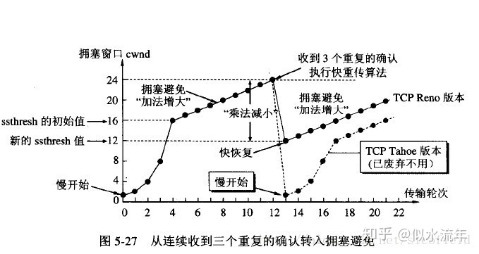

# 面试问题整理

## 计算机网路　https://www.cnblogs.com/0201zcr/p/4694945.html

### OSI

### tcp 和 udp 区别

1. TCP 面向连接，UDP 是无连接的，即发送数据之前不需要建立连接。
2. TCP 提供可靠的服务通过 TCP 连接传送的数据，无差错，不丢失，不重复，且按序到达;UDP 不保证可靠交付。
3. TCP 面向字节流，实际上是 TCP 把数据看成一连串无结构的字节流，UDP 是面向报文的，UDP 没有拥塞控制，因此网络出现拥塞不会使源主机的发送速率降低（对实时应用很有用，实时视频会议）
4. 每一条 TCP 连接只能是一对一，UDP 支持一对一，一对多，多对一和多对多的交互通信。
5. TCP 首部开销 20 字节，UDP 的首部开销只有 8 个字节。
6. TCP 的逻辑通信信道是全双工的可靠信道，UDP 则是不可靠信道。

### Http 请求的完全过程

1. 浏览器根据域名解析 IP 地址（DNS）,并查 DNS 缓存
2. 浏览器与 WEB 服务器建立一个 TCP 连接
3. 浏览器给 WEB 服务器发送一个 HTTP 请求（GET/POST）：一个 HTTP 请求报文由请求行（request line）、请求头部（headers）、空行（blank line）和请求数据（request body）4 个部分组成。
4. 服务端响应 HTTP 响应报文，报文由状态行（status line）、相应头部（headers）、空行（blank line）和响应数据（response body）4 个部分组成。
5. 浏览器解析渲染

### HTTP 1.0/1.1/2.0

#### 1.0

- 浏览器与服务器只保持短暂的连接，浏览器的每次请求都需要与服务器建立一个 TCP 连接，服务器完成请求处理后立即断开 TCP 连接,上一次和下一次请求完全分离

### 1.1

- 持久连接（HTTP/1.1 的默认模式使用带流水线的持久连接），在一个 TCP 连接上可以传送多个 HTTP 请求和响应
- 1xx：指示信息--表示请求已接收，继续处理
- 2xx：成功--表示请求已被成功接收、理解、接受
- 3xx：重定向--要完成请求必须进行更进一步的操作
- 4xx：客户端错误--请求有语法错误或请求无法实现
- 5xx：服务器端错误--服务器未能实现合法的请求

### 2.0

- 多路复用允许同时通过单一的 HTTP/2 连接发起多重的请求-响应消息
- 多路复用允许同时通过单一的 HTTP/2 连接发起多重的请求-响应消息

### tcp 和 udp 的优点

- TCP 的优点： 可靠，稳定 TCP 的可靠体现在 TCP 在传递数据之前，会有三次握手来建立连接，而且在数据传递时，有确认、窗口、重传、拥塞控制机制，在数据传完后，还会断开连接用来节约系统资源。 TCP 的缺点： 慢，效率低，占用系统资源高，易被攻击 TCP 在传递数据之前，要先建连接，这会消耗时间，而且在数据传递时，确认机制、重传机制、拥塞控制机制等都会消耗大量的时间，而且要在每台设备上维护所有的传输连接，事实上，每个连接都会占用系统的 CPU、内存等硬件资源。 而且，因为 TCP 有确认机制、三次握手机制，这些也导致 TCP 容易被人利用，实现 DOS、DDOS、CC 等攻击。
- UDP 的优点： 快，比 TCP 稍安全 UDP 没有 TCP 的握手、确认、窗口、重传、拥塞控制等机制，UDP 是一个无状态的传输协议，所以它在传递数据时非常快。没有 TCP 的这些机制，UDP 较 TCP 被攻击者利用的漏洞就要少一些。但 UDP 也是无法避免攻击的，比如：UDP Flood 攻击…… UDP 的缺点： 不可靠，不稳定 因为 UDP 没有 TCP 那些可靠的机制，在数据传递时，如果网络质量不好，就会很容易丢包。 在日常生活中，常见使用 TCP 协议的应用如下： 浏览器，用的 HTTP FlashFXP，用的 FTP Outlook，用的 POP、SMTP Putty，用的 Telnet、SSH QQ 文件传输。什么时候应该使用 UDP： 当对网络通讯质量要求不高的时候，要求网络通讯速度能尽量的快，这时就可以使用 UDP。 比如，日常生活中，常见使用 UDP 协议的应用如下： QQ 语音 QQ 视频 TFTP。

### 三次握手

- 第一次握手：建立连接时，客户端发送 syn 包（syn=x,1000）到服务器，并进入 SYN_SENT 状态，等待服务器确认；SYN：同步序列编号（Synchronize Sequence Numbers）。
- 第二次握手：服务器收到 syn 包，必须确认客户的 SYN（ack=x+1,1001），同时自己也发送一个 SYN 包（syn=y,2000），即 SYN+ACK 包，此时服务器进入 SYN_RECV 状态；
- 第三次握手：客户端收到服务器的 SYN+ACK 包，向服务器发送确认包 ACK(ack=y+1,2001），此包发送完毕，客户端和服务器进入 ESTABLISHED（TCP 连接成功）状态，完成三次握手。

### 为什么不能两次握手

- 防止已失效的请求连接报文忽然又传送到了，从而产生错误。(如果是两次握手：此时连接就建立了，B 会一直等待 A 发送数据，从而白白浪费 B 的资源。 如果是三次握手：由于 A 没有发起连接请求，也就不会理会 B 的连接响应，B 没有收到 A 的确认连接，就会关闭掉本次连接。)

### 四次挥手

1. 客户端进程发出连接释放报文，并且停止发送数据。释放数据报文首部，FIN=1，其序列号为 seq=u（等于前面已经传送过来的数据的最后一个字节的序号加 1），此时，客户端进入 FIN-WAIT-1（终止等待 1）状态。 TCP 规定，FIN 报文段即使不携带数据，也要消耗一个序号。
2. 服务器收到连接释放报文，发出确认报文，ACK=1，ack=u+1，并且带上自己的序列号 seq=v，此时，服务端就进入了 CLOSE-WAIT（关闭等待）状态。TCP 服务器通知高层的应用进程，客户端向服务器的方向就释放了，这时候处于半关闭状态，即客户端已经没有数据要发送了，但是服务器若发送数据，客户端依然要接受。这个状态还要持续一段时间，也就是整个 CLOSE-WAIT 状态持续的时间。
3. 客户端收到服务器的确认请求后，此时，客户端就进入 FIN-WAIT-2（终止等待 2）状态，等待服务器发送连接释放报文（在这之前还需要接受服务器发送的最后的数据）。
4. 服务器将最后的数据发送完毕后，就向客户端发送连接释放报文，FIN=1，ack=u+1，由于在半关闭状态，服务器很可能又发送了一些数据，假定此时的序列号为 seq=w，此时，服务器就进入了 LAST-ACK（最后确认）状态，等待客户端的确认。
5. 客户端收到服务器的连接释放报文后，必须发出确认，ACK=1，ack=w+1，而自己的序列号是 seq=u+1，此时，客户端就进入了 TIME-WAIT（时间等待）状态。注意此时 TCP 连接还没有释放，必须经过 2∗∗MSL（最长报文段寿命）的时间后，当客户端撤销相应的 TCB 后，才进入 CLOSED 状态。
6. 服务器只要收到了客户端发出的确认，立即进入 CLOSED 状态。同样，撤销 TCB 后，就结束了这次的 TCP 连接。可以看到，服务器结束 TCP 连接的时间要比客户端早一些

### 为什么连接的时候是三次握手，关闭的时候却是四次握手

因为当 Server 端收到 Client 端的 SYN 连接请求报文后，可以直接发送 SYN+ACK 报文。其中 ACK 报文是用来应答的，SYN 报文是用来同步的。但是关闭连接时，当 Server 端收到 FIN 报文时，很可能并不会立即关闭 SOCKET，所以只能先回复一个 ACK 报文，告诉 Client 端，"你发的 FIN 报文我收到了"。只有等到我 Server 端所有的报文都发送完了，我才能发送 FIN 报文，因此不能一起发送。故需要四步握手。

### Get 和 Post 区别

1. Get 是不安全的，因为在传输过程，数据被放在请求的 URL 中；Post 的所有操作对用户来说都是不可见的。
2. Get 传送的数据量较小，这主要是因为受 URL 长度限制；Post 传送的数据量较大，一般被默认为不受限制。
3. Get 限制 Form 表单的数据集的值必须为 ASCII 字符；而 Post 支持整个 ISO10646 字符集。
4. Get 执行效率却比 Post 方法好。Get 是 form 提交的默认方法。
5. GET 产生一个 TCP 数据包；POST 产生两个 TCP 数据包。（非必然，客户端可灵活决定）
